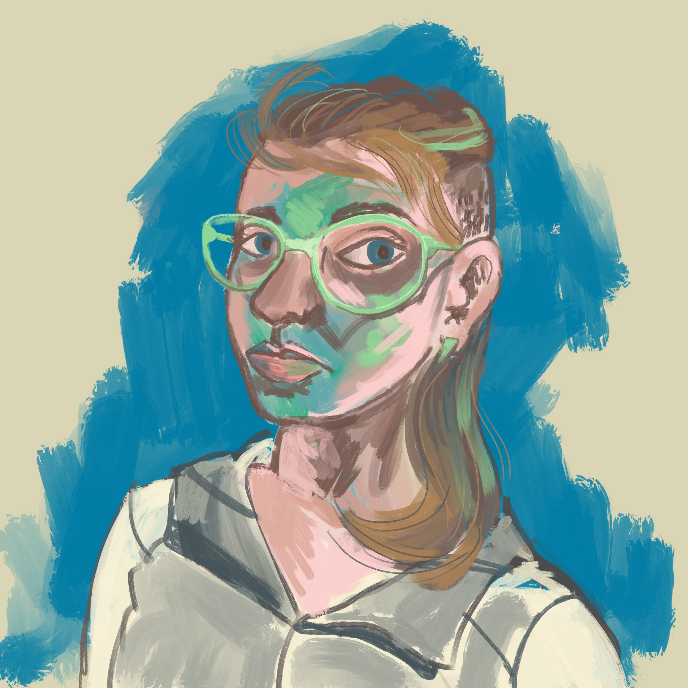

This week my comic about debt was published at the Nib (you should [read it](https://thenib.com/americans-are-drowning-in-debt) if you haven't gotten a chance yet!). I thought I would write  a little about the process of making a piece of comics journalism.

## Ideate

My friends and I are in _a lot_ debt. I’m an X-er (and I’ve got the haircut to prove it), so most of our debt is not “good” debt like a mortgage. We joke about it sometimes, but honestly debt is a very shameful topic in the US so we mostly pretend our lives are really carefree and that we can afford to buy expensive green fruit that is often already rotten when you open it. 

I was really interested in:

1. learning more about debt in the United States and how we got here
2. opening a public dialogue about debt so we can all feel a little less ashamed about it

##  Collaborate
I don’t actually write non-fiction, so all I really had were suspicions about American debt. Luckily I happen to know a writer[*](#a) and activist who used to be a bankruptcy lawyer. I asked [Kevin Moore](https://kevmo.io/) if he’d be interested in doing a comic together about debt based on his "standard American Debt Rant" and he said yes.

This was Kevin’s first comic, so we worked together on an outline for a 30 panel comic, which translates to about 7-8 pages of material and is a fairly standard size for feature-length comics journalism. We decided to cover US debt history, give an overview of the most common kinds of debt, and talk about little about debt futurism.

## Script
We pitched this story to my favorite outlet and they accepted it. I sat back while Kevin did the reporting. We worked with a seasoned comics journalism editor, and he and Kevin took the script through a few drafts.  Once the script was finalized, it was turned over to me for drawing.

## Concept
When I get a finalized script, whether I’ve worked on it at all or not, the first thing I do is sit down and try to find the over-arching visual narrative. I usually do this by doodling on a clean sketchbook page as I read the script over several times. When the page is full, I look for the common threads, and find the ideas that hit me hardest. In this case, what really struck me was how _pervasive_ debt was, and how it sticks to people and things and stops them from moving forward. That’s how I came up with Debt Slime.

Then I go through and cut together a very, very loose version of the comic that shows the basic composition of the page and each panel. I submitted this to my editor, and he gave me some feedback and the go ahead to final art.

## Drawing
Then I drew for nine million years.  After connecting the piece there are three basic stages:
	1. Penciling 
	2. Inking
	3. Coloring 

Each stage takes a pretty long time, so you have to be game for that. It’s really easy to get tunnel vision here, so I got feedback from Kevin and my editor after each stage. That feedback helps push me to my best compositions and visual metaphors.

## Profit!!
Kevin and I got some green fruits to celebrate, and all over they were only about 30% bad. I’m still in a lot of debt, but I do feel slightly less bad about it now.

---
* Kevin actually [just finished a book](https://zerotocode.today/) empowering folks to enter the software development field 
_[go back](#ab)_